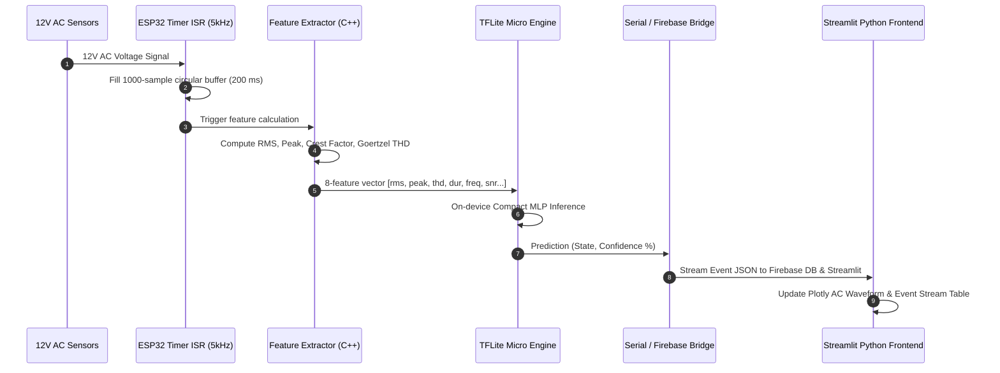

# Power Quality Disturbance (PQD) Classifier — System Architecture & Design Specification

> **A Clean Architecture & SOLID Design Document for Embedded ML & Cloud Telemetry**

---

## 1. Architectural Overview & System Layers

The system follows a strict **Layered Clean Architecture** with **Separation of Concerns**, ensuring high cohesion within modules and low coupling between layers.

```
┌─────────────────────────────────────────────────────────────────────────────┐
│                    PRESENTATION & ANALYTICS LAYER                           │
│   Streamlit + Plotly Python Dashboard  │  React Native Expo Mobile App      │
└──────────────────────────────────────┬──────────────────────────────────────┘
                                       │ Real-time Events & Telemetry
┌──────────────────────────────────────┴──────────────────────────────────────┐
│                  CLOUD TELEMETRY & DATABASE LAYER                           │
│   Firebase DB Service (firebase_service.py)  │  Serial Telemetry Bridge     │
└──────────────────────────────────────┬──────────────────────────────────────┘
                                       │ Quantized TFLite Array (g_model)
┌──────────────────────────────────────┴──────────────────────────────────────┐
│                    EDGE INFERENCE & FIRMWARE LAYER                          │
│   TFLite Micro Runtime (inference.cpp)  │  C++ Feature Extractor            │
└──────────────────────────────────────┬──────────────────────────────────────┘
                                       │ 5 kHz ADC Sample Buffer
┌──────────────────────────────────────┴──────────────────────────────────────┐
│                  HARDWARE & SIGNAL ACQUISITION LAYER                        │
│   ESP32 Timer ISR (5 kHz)  │  Relay State Machine  │  12V AC Sensors        │
└─────────────────────────────────────────────────────────────────────────────┘
```

---

## 2. SOLID Software Engineering Principles Applied

### 2.1 Single Responsibility Principle (SRP)
Each module in the system has a single, well-defined reason to change:
- `ml/generate_dataset.py`: Responsible solely for ingesting, validating, and standardizing the `BARC DATA.csv` dataset.
- `ml/compare_models.py`: Responsible solely for model benchmarking, accuracy/latency evaluation, and safety-critical recall validation.
- `ml/convert_tflite.py`: Responsible solely for int8 quantization and exporting the C byte header `model_data.h`.
- `firmware/src/feature_extraction.cpp`: Responsible solely for computing the 8-feature DSP vector (RMS, Goertzel THD, crest factor, frequency).
- `firebase/firebase_service.py`: Responsible solely for Firestore/Realtime DB read/write operations.
- `app_frontend.py`: Responsible solely for UI presentation, Plotly waveform rendering, and user interactivity.

### 2.2 Open/Closed Principle (OCP)
- **Extensible Feature Extractor**: `extractFeatures()` returns a structured `PQDFeatures` struct. New DSP features can be added without altering the TFLite Micro inference execution signature.
- **Extensible Model Benchmarking**: `compare_models.py` uses a dictionary-driven candidate registry (`models = {...}`), allowing new scikit-learn or PyTorch models to be benchmarked without changing evaluation or plotting code.

### 2.3 Liskov Substitution Principle (LSP) & Dependency Inversion (DIP)
- High-level validation services ([validation/test_harness.py](file:///d:/Major%20proj/validation/test_harness.py)) depend on abstract database interfaces (`FirebaseDBService`), allowing seamless substitution between **Live Firebase Firestore** and **Local Offline Mock Service** without breaking client code.

---

## 3. Data Flow & Sequence Diagram



---

## 4. Error Handling, Safety & Reliability Guarantees

### 4.1 Safety-Critical Interruption Recall Requirement
In electrical power distribution, missing an **Interruption** event ($\text{Recall} < 90\%$) can lead to severe equipment damage. `compare_models.py` automatically flags any candidate model that fails this threshold.

### 4.2 Hardware Watchdog Protection
The ESP32 firmware initializes `esp_task_wdt` in `main.cpp` and `relay_control.cpp`. If a sensor glitch or infinite loop halts execution for $> 2.0\text{ seconds}$, the hardware WDT trips and safely resets the relay state machine to `STATE_NORMAL`.

### 4.3 Confidence Thresholding
The on-device inference engine (`inference.cpp`) checks prediction confidence. If confidence $< 60.0\%$, the output is flagged as `UNCERTAIN` rather than displaying a false classification label.

---

## 5. API Contracts & Data Schema Specification

### 5.1 Standardized 8-Feature Vector Schema

| Index | Feature Name | Source Column | Type | Unit | Range / Description |
|---|---|---|---|---|---|
| 0 | `rms_voltage` | `V_rms_pu` | `float32` | per-unit | 0.0 – 2.0 pu |
| 1 | `peak_voltage` | `V_peak_pu` | `float32` | per-unit | 0.0 – 3.0 pu |
| 2 | `crest_factor` | `Crest_Factor` | `float32` | ratio | 1.0 – 5.0 |
| 3 | `thd` | `THD_percent` | `float32` | % | 0.0 – 50.0% |
| 4 | `duration` | `Duration_ms` | `float32` | ms | 0.0 – 5000.0 ms |
| 5 | `dominant_freq` | `Dominant_Freq_Hz` | `float32` | Hz | 50.0 – 1500.0 Hz |
| 6 | `system_freq` | `Freq_Hz` | `float32` | Hz | 45.0 – 55.0 Hz |
| 7 | `snr` | `SNR_dB` | `float32` | dB | 10.0 – 60.0 dB |

### 5.2 Firebase Disturbance Event Document Schema (`events` Collection)

```json
{
  "event_id": "EVT_1785300793",
  "timestamp": 1785300793,
  "true_state": "Sag",
  "predicted_class": "Sag",
  "confidence": 0.942,
  "rms_voltage": 0.624,
  "thd": 1.15,
  "duration_ms": 45.0,
  "snr_db": 42.5,
  "device_id": "ESP32_PQD_01"
}
```

---

## 6. Code Refactoring & Formatting Standards

- **PEP 8 Compliance**: Explicit 4-space indentation, clear variable naming (`snake_case` for functions/variables, `PascalCase` for classes).
- **Type Annotations**: All Python module public functions include strict type hints (`def process(data: pd.DataFrame) -> Dict[str, Any]:`).
- **Clean Exception Handling**: Zero silent try-except blocks. All network and filesystem operations log explicit errors with fallbacks.
