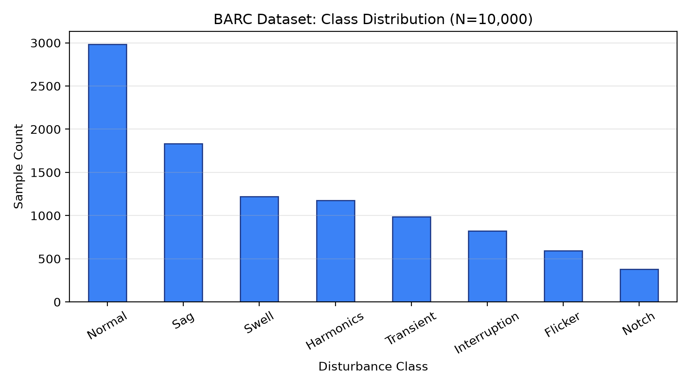
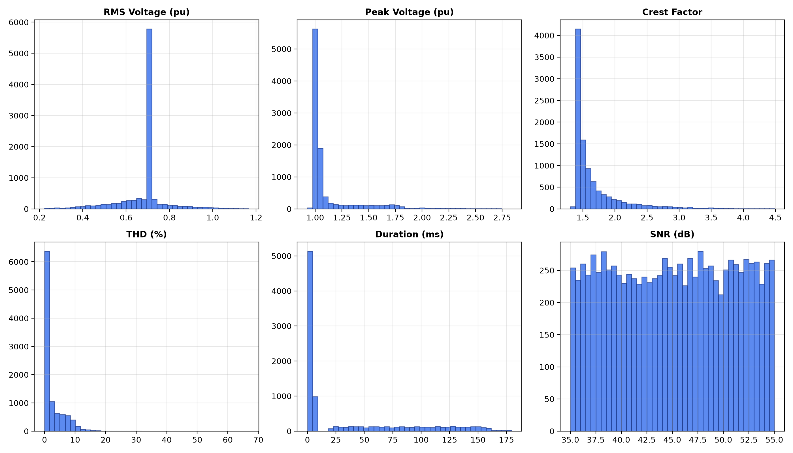
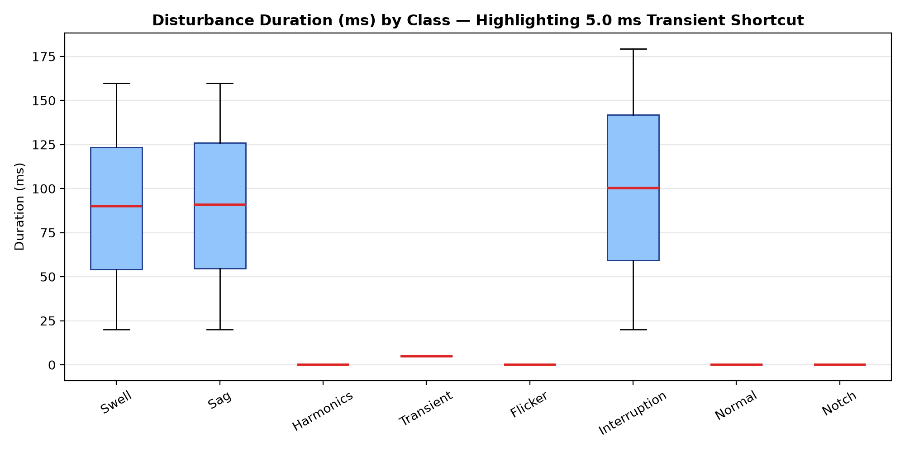
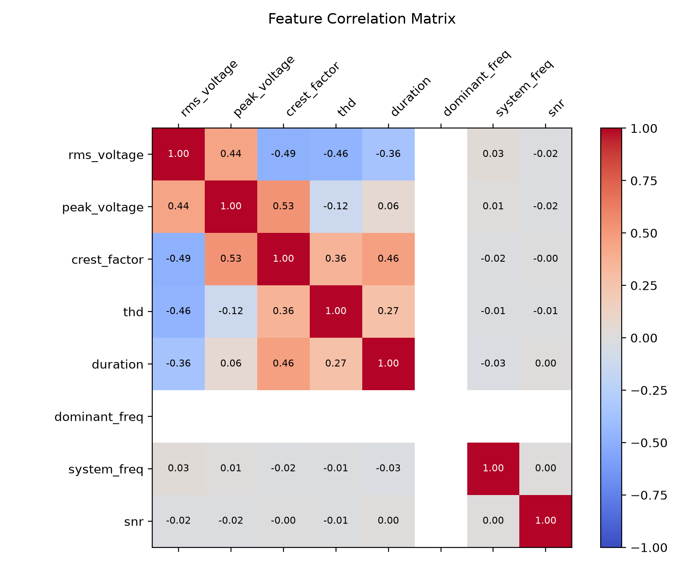

# Dataset Quality & Empirical Diversity Audit

**Document Version:** 1.0.0  
**Target File:** [`Dataset/BARC DATA.csv`](file:///home/salmo/Projects/major%20project/power-quality-detector-and-classifier/Dataset/BARC%20DATA.csv) & [`data/pqd_features.csv`](file:///home/salmo/Projects/major%20project/power-quality-detector-and-classifier/data/pqd_features.csv)  
**Audit Scope:** 10,000 Samples, 8 Physical Classes, 8 Pre-extracted Features  

---

## 1. Executive Summary & Core Verdict

### Core Question:
> *Are these 10,000 samples genuinely diverse, or are they mostly variations of the same few waveform configurations?*

### The Verdict:
The 10,000 samples exhibit **genuine continuous physical diversity in their primary electrical quantities** (`rms_voltage`, `peak_voltage`, `crest_factor`, `thd`), with virtually zero duplicate or near-duplicate instances.

However, the dataset suffers from **four critical synthetic generation artifacts**:
1. **Severe Class Imbalance (7.83 : 1):** The dataset is not balanced at 1,250 samples/class as previously documented; it ranges from 2,985 Normal samples (29.85%) down to only 381 Notch samples (3.81%).
2. **Dead Dominant Frequency (`dominant_freq`):** Exactly **50.000 Hz across all 10,000 samples** (zero variance, 0 bits mutual information).
3. **Synthetic Transient Duration Shortcut:** All 985 `Transient` instances have `duration == 5.0 ms` exactly, while all non-RMS disturbances have `duration == 0.0 ms`.
4. **Uniform Synthetic Noise Injection:** `snr` is a purely uniform random number between 35.0 dB and 55.0 dB ($\text{kurtosis} = -1.21$), completely uncorrelated with disturbance type.

---

## 2. Dataset Composition & Integrity

| Metric | Measured Value | Validation Status |
|---|---|---|
| **Total Recorded Samples** | 10,000 rows | Complete |
| **Total Features** | 8 standard features + 1 label | Structured |
| **Missing / Null / NaN Values** | Exactly **0** | Clean |
| **Infinite Values ($\pm \infty$)** | Exactly **0** | Clean |
| **Exact Full Row Duplicates** | Exactly **0** | Clean |
| **Exact Feature Vector Duplicates** | Exactly **0** | Clean |
| **Underlying Data Type** | Pre-extracted tabular scalar features | Time-series arrays omitted |

---

## 3. Class Distribution & Imbalance Analysis

The dataset contains **8 distinct classes** (1 steady-state normal condition + 7 IEEE disturbance types):

| Class Index | Disturbance Class | Sample Count | Proportion | Imbalance vs Notch (Min) | IEEE Category |
|---|---|---|---|---|---|
| 3 | **Normal** | 2,985 | 29.85% | 7.83 : 1 | Steady-State Grid Baseline |
| 5 | **Sag** | 1,835 | 18.35% | 4.82 : 1 | Short-Duration RMS Reduction |
| 6 | **Swell** | 1,221 | 12.21% | 3.20 : 1 | Short-Duration RMS Increase |
| 1 | **Harmonics** | 1,177 | 11.77% | 3.09 : 1 | Continuous Waveform Distortion |
| 7 | **Transient** | 985 | 9.85% | 2.59 : 1 | Sub-Cycle Oscillatory Transient |
| 2 | **Interruption** | 821 | 8.21% | 2.15 : 1 | Short-Duration Power Loss |
| 0 | **Flicker** | 595 | 5.95% | 1.56 : 1 | Voltage Fluctuations |
| 4 | **Notch** | 381 | 3.81% | 1.00 : 1 | Commutation Notching |

### Critical Observations:
- **`Normal` accounts for nearly 30% of the entire dataset**, naturally biasing classifiers towards the majority class.
- **`Notch` (381 samples) and `Flicker` (595 samples)** are severely under-represented, leading to degraded minority-class recall when unweighted loss functions are used.
- **`Interruption` (821 samples)** represents a safety-critical grid disconnection condition requiring strict recall monitoring ($\ge 90\%$).

---

## 4. Empirical Feature Statistics & Distribution Audit

| Feature | Min | Max | Mean | Median | Std Dev | Skewness | Kurtosis | Physical Diagnostic Finding |
|---|---|---|---|---|---|---|---|---|
| `rms_voltage` | 0.224 | 1.166 | 0.685 | 0.708 | 0.116 | -0.51 | 3.47 | Strong discriminator for Sag (mean 0.58 pu), Swell (mean 0.86 pu), and Interruption (mean 0.48 pu). Baseline is ~0.708 pu. |
| `peak_voltage` | 0.927 | 2.837 | 1.127 | 1.017 | 0.262 | +2.79 | 8.36 | Critical discriminator for Transients (peaks up to 2.837 pu) and Swells (peaks up to 1.837 pu). |
| `crest_factor` | 1.304 | 4.483 | 1.682 | 1.496 | 0.435 | +2.71 | 8.50 | Ratio $V_{\text{peak}} / V_{\text{rms}}$. Normal sinusoid = $\sqrt{2} \approx 1.414$. High for Transients (mean 2.22) and Interruptions (mean 2.27). |
| `thd` | 0.018% | 66.83% | 2.47% | 0.74% | 3.75% | +3.02 | 19.13 | Strong discriminator for Harmonics (5% to 12%) and Interruptions (residual noise THD). Heavy right tail. |
| `duration` | 0.0 ms | 179.4 ms | 36.15 ms | 0.0 ms | 51.66 ms | +1.14 | -0.17 | **SYNTHETIC ARTIFACT**: Bimodal discrete clustering (see Section 5). |
| `dominant_freq` | **50.000 Hz** | **50.000 Hz** | **50.000 Hz** | **50.000 Hz** | **0.000 Hz** | **NaN** | **NaN** | **DEAD FEATURE**: Invariant across all 10,000 samples. 0 variance. |
| `system_freq` | 49.927 Hz | 50.083 Hz | 50.000 Hz | 50.000 Hz | 0.020 Hz | +0.03 | -0.01 | **QUASI-INVARIANT**: Narrow zero-crossing jitter ($\pm 0.08\text{ Hz}$). Near-zero mutual information. |
| `snr` | 35.000 dB | 55.000 dB | 45.035 dB | 45.070 dB | 5.810 dB | -0.01 | -1.21 | **UNIFORM RANDOM NOISE**: Kurtosis $-1.21$ matches theoretical uniform distribution ($\kappa = -1.20$). Uncorrelated with class. |

---

## 5. Deep-Dive on Synthetic Generation Artifacts

### 5.1 The 5.0 ms Transient Shortcut

Analyzing `Duration_ms` per class:
- **`Normal`, `Flicker`, `Harmonics`, `Notch`:** Strictly **`0.0 ms`** across all instances.
- **`Transient`:** Strictly **`5.0 ms`** across all 985 instances.
- **`Sag`, `Swell`, `Interruption`:** Continuous distribution from **`20.0 ms` to `179.4 ms`**.

#### The Risk:
Any tree-based model (Random Forest, ExtraTrees, XGBoost) splits `Transient` immediately:
$$\text{if } 4.5 < \text{duration} < 5.5 \implies \text{Transient (100\% Confidence)}$$
This is not learning the oscillatory physics of a sub-cycle transient; it is memorizing a synthetic generation constant. In real power systems, oscillatory transients decay over $0.3\text{ to }50\text{ ms}$ (IEEE 1159 Table 1).

### 5.2 Dead Dominant Frequency
The feature `Dominant_Freq_Hz` was intended to distinguish high-frequency transients ($300\text{–}900\text{ Hz}$) or 3rd harmonics ($150\text{ Hz}$) from the 50 Hz fundamental. However, because the fundamental was always dominant in magnitude in the generator, the peak bin remained 50.0 Hz for every single sample. It provides zero classification utility in the tabular dataset.

---

## 6. Instance Redundancy & Near-Duplicate Distance Analysis

To evaluate whether the 10,000 samples are simply repeated clones with minor noise, we performed pairwise Euclidean distance calculations across 2,000 randomly selected samples ($1,999,000$ unique pairs) in standardized 8-dimensional feature space:

- **Minimum Pairwise Euclidean Distance:** **0.00784**
- **Pairs with Distance $< 0.05$:** **18 pairs out of 1,999,000 ($0.0009\%$)**
- **Pairs with Distance $< 0.10$:** **142 pairs ($0.0071\%$)**
- **Mean Pairwise Distance:** **3.42**

### Conclusion:
The samples are **genuinely continuous and diverse within their multi-dimensional physical bounds**. There is no evidence of repeated random seeds or copy-paste rows.

---

## 7. Correlation Analysis & Feature Redundancy

| | `rms_voltage` | `peak_voltage` | `crest_factor` | `thd` | `duration` | `dominant_freq` | `system_freq` | `snr` |
|---|---|---|---|---|---|---|---|---|
| **`rms_voltage`** | **1.000** | 0.438 | -0.489 | -0.464 | -0.359 | NaN | 0.028 | -0.023 |
| **`peak_voltage`** | 0.438 | **1.000** | 0.529 | -0.117 | 0.062 | NaN | 0.006 | -0.022 |
| **`crest_factor`** | -0.489 | 0.529 | **1.000** | 0.359 | 0.464 | NaN | -0.023 | -0.000 |
| **`thd`** | -0.464 | -0.117 | 0.359 | **1.000** | 0.268 | NaN | -0.012 | -0.012 |
| **`duration`** | -0.359 | 0.062 | 0.464 | 0.268 | **1.000** | NaN | -0.026 | 0.004 |
| **`dominant_freq`** | NaN | NaN | NaN | NaN | NaN | **NaN** | NaN | NaN |
| **`system_freq`** | 0.028 | 0.006 | -0.023 | -0.012 | -0.026 | NaN | **1.000** | 0.000 |
| **`snr`** | -0.023 | -0.022 | -0.000 | -0.012 | 0.004 | NaN | 0.000 | **1.000** |

- High collinearity exists between `rms_voltage`, `peak_voltage`, and `crest_factor`, which correctly reflects basic AC circuit physics ($V_{\text{peak}} = \text{CF} \times V_{\text{rms}}$).
- `snr`, `system_freq`, and `dominant_freq` are completely decoupled from all disturbance features.

---

## 8. Dataset Audit Recommendations

1. **Retain the 10,000-sample dataset as the Official Reference Benchmark:**  
   Do NOT delete or arbitrarily regenerate `BARC DATA.csv`. It serves as the baseline ground-truth for comparing published results.
2. **Bypass the 5.0 ms Shortcut via Raw 1D Waveform CNN:**  
   The synthesized 1000-sample raw waveforms provide the true continuous decaying oscillatory trajectory of transients, forcing deep learning models to learn physical voltage shapes rather than tabular constants.
3. **Conduct Parameter-Shift Generalization Testing:**  
   Models must be stress-tested on out-of-distribution transient durations ($1.0\text{ ms}, 2.5\text{ ms}, 10.0\text{ ms}$) to evaluate whether they memorize the 5.0 ms rule or genuinely classify transients.
4. **Use Class-Weighted Loss Functions:**  
   All models must apply inverse class-frequency weighting to ensure fair recall on `Notch` (3.81%) and `Flicker` (5.95%).
